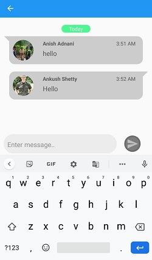

# DS164_A2M
## Problem Statement: Development of App to capture the field patrolling track of frontline staff in their forest beat jurisdiction.
Problem Statement Description: Develop an app to capture information related to field patrolling officers for forest and wildlife assets patrolling personnel posted in the field.The following information can be recorded - 
1. location for their safety,
2. asset, location, and other information about the asset like weight, etc depending on the asset.

*A major requirement of this app will be offline abilities. It should work without internet access. This can be done by having sync functionality and subsequent edits should be recorded in the app and synced later on once the user is Online.*

# Teck Stack
## Web and Mobile Application:
### Front End :
JAVA, XML, Android, HTML5, CSS , Bootstrap, Javascript, Laravel
### Back End :
PHP
### Database:
Firebase Database, SQLite,  SharedPreference.

# Requirements
## Android Specification
- Minimum SdkVersion 24
- TargetSdkVersion 29
- VersionCode 1
- sourceCompatibility JavaVersion.VERSION_1_8
- Firebase version 15.+

## Other Requirements
- [PlotProjects] (https://www.plotprojects.com/)for Geo-fencing
- [Hypertrack] (https://www.hypertrack.com/)for tracking purposes

# Main Objective

### 1. Geo-fencing Module
        1. Alert zone
### 2. Staff Management Module
        1. Mark my attendance
        2. Resources allocation
        3. Notification Activity
        4. Profile Page
        5. Your Tracker
### 3. Dairy Management 
        1. Launch complaint
        2. Mark Checkpoint
### 4. Report generation & Miscellaneous
        1. News Broadcasting
        2. Report genration 
            - Complaint Report
            - Attendance Report
        3. Multilingual
        4. Chatbhot
        5. Andaman and Nicobar Island
### 5. Offilne Mode 
### 6. (SOS Button) Emergency Assistance

## Registration:
        - The Forest officer has to authenticate by scanning the QR code of Aadhar card so it 
        automatically fetches all the required information.
        - The status details are to be filled mainly about division, ranges and beats.
        Lastly, the verification request will be sent to their superior. Once they accept, the officer is verified.

## 1. Geo-fencing Module

- Based on the interpretation of IRS satellite data of the period Apr 2017 to Mar 2018, the Forest Cover in the UT is 6,742.78 sq km which is 81.74 % of the UT's geographical area.
- The forest area is divided into 8 divisions, subdivided into ranges and then into beats and each beat is allocated to each beat officer.
- A notification is sent when the patrolling officer moves from one beat to another. 

 ### 1.1. Alert zone 

1. The forest officer can create or view the zones near him.
2. They are either yellow,red zone and blue zone . Yellow zone are for illegal tree cutting and red for poaching      activity.
3. This will help the officers in getting vivid clarification of the areas which requires special attention.
4. The officer can create the new zone by providing the details like type of zone and radius of zone(in meters).

## 2. Staff Management / Hierarchy

- The Forest department hierarchy is divided into various sub-levels which consists of :
1. DCF/DFO (Deputy Conservator of Forests or Divisional Forest Officer) at Division Level
2. RFO( Range forest officer) at Rangers level
3. Beat guards at beat level.
4. Forest guard.

### 2.1. Attendance marker
- We have added a two-way authentication process to avoid forgery. To mark the attendance follow the procedure :
1. The officer has to click a picture for face authentication 
2. Scan the QR code and if it matches then he will get verified.

### 2.2. Resource Allocation(Department Assets, Forests Resources): 

- Our app assists in the allocation and helps to maintain logs.
- DCF/DFO and RFO have the authority to allocate and deallocate the resources to the beat guards.
- The logs can be viewed by a higher officer which contents Assigned by, Assigned To and Date and Time). 
- The beat guard has to return the assigned resource to their superior once the use is done and update in the    application .

### 2.3. Notification Activity:

The user is mainly notified about :

- Attendance verification :  When attendance is marked.
- Attendance misbehaviour :  Whenanyone tries to give false  attendance  he will be notified so that he can be alert.
- Case reported : When an officer reports a case.
- Checkpoint marked : When the officer travels from one checkpoint to another.

### 2.4. Profile Page:

The officer can view and update his own profile. It consists of user information 
-  Tracking link 
-  Personal details 
-  Resources allocated to him.

Also, he can view his attendance %, experience and reviews.

### 2.5. Your Tracker :

- To track the path of a particular officer. 
- One can also share his trip to other officers in an emergency.

## 3. Diary maintenance
        
### 3.1. Launch  Complaint: 
The officer can view the various complaints and their details.Also enables an officer to file a report against illegal activities.
There are 2 tabs :
- Open : Which is visible to all the officers.
- Serious : Which is visible to the higher officers.

They can view the details of the full case and also export as pdf which is stored in internal storage and pdf can easily be shared through whatsapp or other platforms.
For filling a case :
- The officer has to fill all credentials like  Complaint type, Access (open or restricted), Details of the complaint, Checkpoint number, Time and Date
- Upload the captured images
- *An additional feature of e-signature has been added to enhance security.*

### 3.2. Mark Checkpoint / Observation recording:
- While patrolling, each officer has been given a certain area to cover.So, the area that he has to cover is divided into 4 checkpoints.
- He has to enter the data about what he has found during the patrolling and also upload the related images and the current checkpoint is done.
- He has to follow the same procedure until he completes all the 4 checkpoints.

## 4. Report generation & Miscellaneous

### 4.1. News Broadcasting

- This feature is controlled by the admin.
- The admin decides the news which needs to be broadcasted to all the officers considering the severity of the case.
- The admin can delete and add posts that are broadcasted to all the officers.

### 4.2. Report generation

- This application provides the feature of generating reports for complaints.
- The generated pdf for complaints consist of images and information that were uploaded during complaint registration along with the e-signature.
- Another type of pdf generated is for classifying the type of complaints and displaying all the complaints under different categories.

### 4.3. Chatbhot:

- The officer can chat with their colleague one on one easily.

### 4.4. Andaman and Nicobar Island:
- It contains all the details about divisions and ranges of Andaman Forest. 

## 5. Offline Mode
- In case of absence of network connection, the data is stored in the offline database which is synced to the central database when the device is online again.

## 6. SOS Button (Emergency call button)

- This feature enables the user to contact the closest officer in his/her vicinity.
- This feature uses the location of every other officer stored in the Firebase database for calculating the distance between the user and the closest officer.
- The contact details of 3 officers closest to the vicinity of the user are displayed on the screen.
- Network Provider and GPS Provider is used in tracking the location of the officers.

# Admin Dashboard 
1. Monitor Attendance (Date wise)
2. Monitor Beat Activity 
3. Verify Ofiicer 
4. View Zones
5. View Activity on Map
6. Generate OR code
7. News broadcasting

### 1. Monitor Attendance (Date wise)
- The admin can view the day-wise attendance report of all the officers.
 
### 2. Monitor Beat Activity 

        
### 3. Verify Ofiicer 

### 4. View Zones

### 5. View Activity on Map
- The admin can view the reports which depict the illegal tree cutting, poaching activities.  
  
### 6. Generate QR code
- The admin can generate beat QR code by entering the details like division name, range name, beat name and checkpoint name and can generate pdf.

### 7. News broadcasting
- All the things that are happening around the officer will be broadcasted So the officer will get updated about 
forgery, illegal activities happening around him, and also he can be alert.
- The admin can add and delete the broadcasted news
