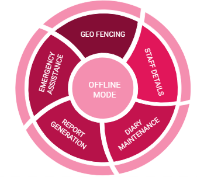

# DS164_A2M
# Final application Folder- SIH_3rd_August_Final_Submission/Sih
[Final Project](SIH_3rd_August_Final_Submission/Sih)

## Contents of this file
* Problem Statement
* Problem Description
* Tech stack
* Requirements
* External Dependencies
* Use case diagram
* System implementation details

        - Admin dashboard
                1. Creation of Geo-fenced area
                2. Monitor Attendance (Date wise)
                3. Monitor Beat Activity 
                4. Verify Officer 
                5. View Zones
                6. View Activity on Map
                7. Generate QR code
                8. News broadcasting
        - Users (Officers)
                1. Geo-fencing Module
                        1.1 Alert zone
                2. Staff Management Module
                        2.1 New user Registration
                        2.2 Mark my attendance
                        2.3 Resources allocation
                        2.4 Notification Activity
                        2.5 Profile Page
                        2.6 Your Tracker
                3. Diary Management 
                        3.1 Launch complaint
                        3.2 Mark Checkpoint
                4. Report generation & Miscellaneous
                        4.1 News Broadcasting
                        4.2 Report genration 
                            - Complaint Report
                            - Attendance Report
                        4.3 Multilingual
                        4.4 In-built chat feature
                        4.5 Andaman and Nicobar Island
                5. Offilne Mode 
                6. (SOS Button) Emergency Assistance
                7.User-friendly
                        7.1 Multi-Lingual
                        7.2 Speech Recognition

# Problem Statement: 
## Development of App to capture the field patrolling track of frontline staff in their forest beat jurisdiction.

# Problem Statement Description: 
Develop an app to capture information related to **field patrolling officers** for forest and wildlife assets for patrolling personnel posted in the field.

The following information can be recorded - 
1. location for their **safety**,
2. **asset**, location, and other information about the asset like weight, etc depending on the asset.

A major requirement of this app will be **offline abilities**. It should work without internet access. This can be done by having **sync functionality** and subsequent **edits** should be recorded in the app and synced later on once the user is Online.

# Tech Stack:
## Web and Mobile Application:
### Front End :
JAVA, XML, Android, HTML5, CSS , Bootstrap, Javascript, Laravel
### Back End :
PHP
### Database:
Firebase Database, SQLite,  SharedPreference.

# Requirements:
## Android Specification:
- Minimum SdkVersion 24
- TargetSdkVersion 29
- VersionCode 1
- sourceCompatibility JavaVersion.VERSION_1_8
- Firebase version 15.+

# External Dependencies:
- [PlotProjects] (https://www.plotprojects.com/) for Geo-fencing.
- [Hypertrack] (https://www.hypertrack.com/) for tracking purposes.

# Use-case diagram:

# System implementaion for Admin :
### 1.Creation of Geo-fenced area:

- Based on the interpretation of IRS satellite data of the period Apr 2017 to Mar 2018, the Forest Cover in the UT is 6,742.78 sq km which is 81.74 % of the UT's geographical area.
- The forest area is divided into 8 divisions, subdivided into ranges and then into beats and each beat is allocated to each beat officer.
- This feature enables the admin to create new geo-fences.

### 2. Monitor Attendance (Date wise):
- The admin has the provision to view the attendance of the officers on a specific date.
 
### 3. Monitor Beat Activity:
-This feature enables the admin to monitor all activities of the officers at a specific checkpoint.
        
### 4. Verify Officer:
- This feature enables the admin to verify new users, who have recently registered. 
- This will ensure that no illegitimate registration takes place.

### 5. View Zones:
- This provision enables the admin to **add** or **remove** red, blue or yellow regions.
- Red region represents Poaching activities, while yellow regions represents illicit tree cutting. The blue region represents encroachment.

### 6. View Activity on Map:
- The admin can view the coordinates of the illegal tree cutting and poaching activities.  
  
### 7. Generate QR code:
- This feature enables the admin to create various types of QR codes which will be later used by the officers for marking attendance.
- This feature is unique to admin.

### 8. News broadcasting:
- The admin decides the news which need to be broadcasted to all the officers considering the severity of the case.
- The admin can add or delete posts which are broadcasted to all the officers.

# System implementation for Users (Officers):

## 1. Geo-fencing Module:

- The forest area is divided into 8 divisions, subdivided into ranges and then into beats and each beat is allocated to each beat officer.
- A notification is sent when the patrolling officer moves from one beat to another. 

 ### 1.1 Alert zone: 

1. The forest officer can create or view zones near them.
2. They are either yellow,red zone or blue zone. The Yellow zones represents illicit tree cutting and red represents poaching activities.
3. This will help the officers in getting vivid idea of the areas which requires special attention.
4. The officer can create the new zone by providing the details like type of zone and radius of zone(in meters).

## 2. Staff Management / Hierarchy:

- The Forest department hierarchy is divided into various sub-levels which consists of :
        1. DCF/DFO (Deputy Conservator of Forests or Divisional Forest Officer) at Division Level
        2. RFO (Range forest officer) at Range level
        3. Beat guards at beat level
        4. Forest guard

### 2.1 Registration:
- The Forest officer has to register by scanning the **QR code of the Aadhar card** which will enhance the authentication feature of the app. 
- The required **information is fetched** automatically which reduces the burden of manually entering each and every field.
- The other fields such as information regarding division, ranges and beats has to be entered manually.
- The registration process is completed only after the admin or other higher level officer **verifies** the registration.

### 2.2 Attendance marker:
- We have implemented a two-way authentication process to avoid forgery. For attendance marking, the officer has to follow two-step process:
1. The officer has to click a picture for face authentication 
2. Then the user will be navigated to the QR code section, once the QR code is scanned, the location of the user is also stored to avoid illegitimate attendance marking.

### 2.3 Resource Allocation (Department Assets): 

- This feature enables the higher officer to **allocate and deallocate resources** to the lower officers. There is a feature of maintaining **logs** which is automatically updated when a resource is allocated or surrendered.
- The higher level officers can allocate and deallocate resources to the lower officers.
- The logs can be viewed by the higher officer, which is represented in the tabular format (Assigned by, Assigned To and Date and Time). 
- The beat guard can surrender the assigned resources after completing their task.

### 2.4 Notification Activity:

The user is mainly notified about :

- Attendance verification :  on successful marking of attendance.
- Attendance misbehaviour :  If someone tries to give false  attendance then  they will be notified so that he can be alert.
- Case reported : When an officer succefully reports a case.
- Checkpoint marked : When the officer travels from one checkpoint to another.

### 2.5 Profile Page:

The officer can view and update his own profile. It consists of following informations: 
-  Tracking link 
-  Personal details 
-  Resources allocated to them

Also, they can view their attendance, experience and reviews.

### 2.6 Your Tracker :

- This feature is used To track the path followed by a particular officer to ensure their safety. 
- The location of the officer is visible only to the higher officers.

## 3. Diary maintenance:
        
### 3.1. Launch  Complaint: 
The officer can view various complaints and their details. Also enables an officer to file a report against illegal activities.
For viewing recorded cases there are 2 types of cases:
- Open cases: Which is visible to all the officers.
- Serious cases: Which is visible only to the restricted officers according to their hierarchy.

They can view the details of the full case and also export as pdf which is stored in internal storage and pdf can easily be shared through whatsapp or other platforms.
For filling a case :
- The officer has to fill all credentials like  Complaint type, Access (open or restricted), Details of the complaint, Checkpoint number, Time and Date
- Upload the captured images
- *An additional feature of e-signature has been added to enhance security.*

### 3.2. Mark Checkpoint / Observation recording:
- While patrolling, each officer has been given a certain area to cover.So, the area that he has to cover is divided into 4 checkpoints.
- He has to enter the data about what he has found during the patrolling and also upload the related images and the current checkpoint is done.
- He has to follow the same procedure until he completes all the 4 checkpoints.

## 4. Report generation & Miscellaneous:

### 4.1. News Broadcasting:

- This feature is controlled by the admin.
- Only admin has the privilege to decide which news needs to be broadcasted to all the officers considering the severity of the case.
- The officers can only view these news.

### 4.2. Report generation:

- This application provides the feature of generating reports for complaints.
- The generated pdf for complaints consist of images and information that were uploaded during complaint registration along with the e-signature.
- Another type of report generated is for classifying the type of complaints and displaying all the complaints under different categories.

### 4.3. In-built chat feature:

- This application has an in-built chat application for the officers.
- This feature enables the officer to share information with their fellow officer through chat.

### 4.4. Andaman and Nicobar Island:
- It contains information regarding the divisions and ranges of Andaman and Nicobar Forest. 

## 5. Offline Mode:
- This feature is added considering the fact that the officers will not have a continuous internet service in the forest.
- While being offline, the user will have the the privilege of registering a complaint which will be later synced to the central database.

## 6. SOS Button (Emergency call button):

- This feature enables the user to contact the closest officer in his/her vicinity.
- This feature uses the location of every other officer stored in the Firebase database for calculating the distance between the user and the closest officer.
- The contact details of 3 officers closest to the vicinity of the user are displayed on the screen.
- Network Provider and GPS Provider is used in tracking the location of the officers.

## 7.User-friendly:

### 7.1. Multi-Lingual:
To make this application understandable to lay users we have provided multilingual support. So it would be easy for officer to handle this app. He can choose the language in which he is comfortable.

### 7.2. Speech Recognition:
To make an application user friendly we have added text to speech feature which will enable an officer to voice command an application. 

**All the above Functionalities are available on the WebApp too.**
